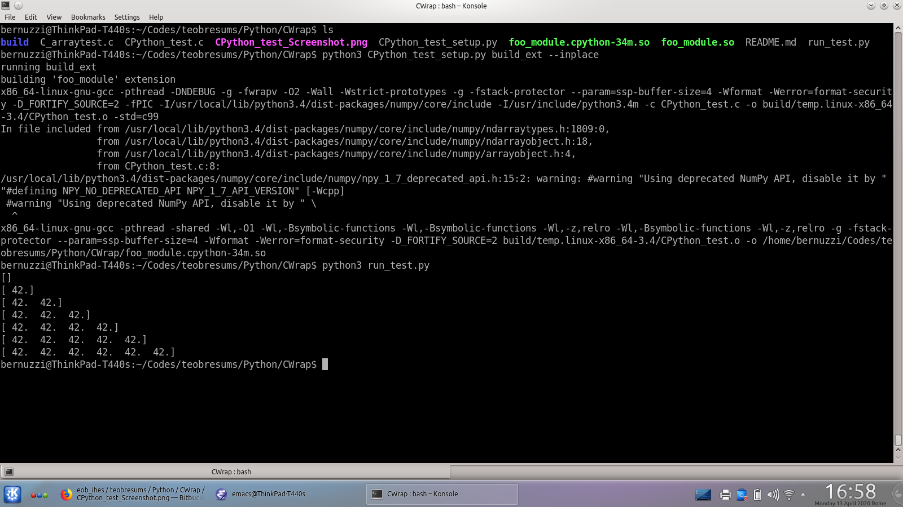

# Tests to wrap C code into python

References:

 * [scipy-lectures](https://scipy-lectures.org/advanced/interfacing_with_c/interfacing_with_c.html)
 * [ipython nb](https://ipython-books.github.io/54-wrapping-a-c-library-in-python-with-ctypes/)
 * [CTBrown tutorial](https://intermediate-and-advanced-software-carpentry.readthedocs.io/en/latest/c++-wrapping.html)

We explore two low-level methods.

SB 11/2019

## Python-C-API

The source code is `CPython_test.c` and should be compiled with the
standard python build system `distutils` from a setup file `CPython_test_setup.py`:

```
$ python CPython_test_setup.py build_ext --inplace
```

Now there's a build of the library/python module that can be accessed
with standard python way. See e.g. `run_test.py`. Here below there is
a picture of the workflow with a standard Ubuntu installation.



The main references to build this code were:
 * `C_arraytest.c` from SciPy Cookbook (saved in this repo)
 * [these scipy lectures](https://scipy-lectures.org/advanced/interfacing_with_c/interfacing_with_c.html)

## CTypes

TODO


